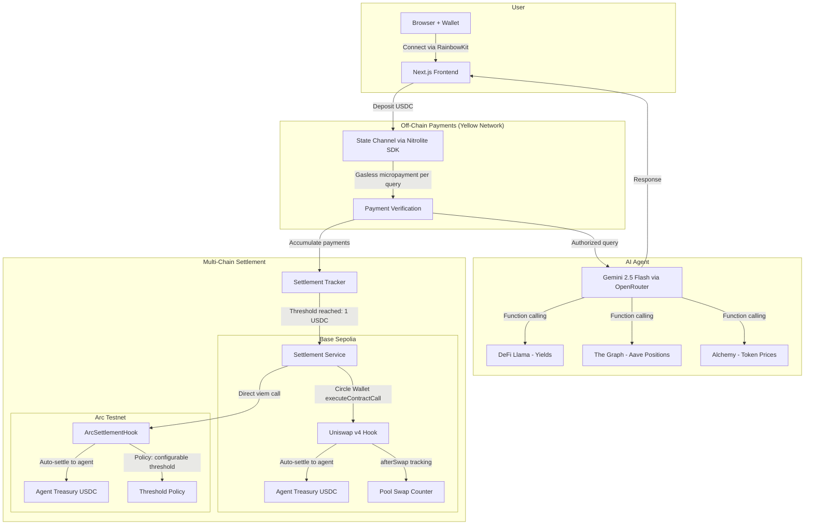

# QueryFi — Pay-per-Query DeFi Analytics

AI agent for on-demand DeFi analytics — yield opportunities, position health, impermanent loss, portfolio analysis — priced per-query ($0.01–$0.10) via gasless state channel micropayments.

No subscriptions. No overpaying. Connect, deposit, ask.

## Problem

DeFi analytics tools are either free (low quality, data harvesting) or $20–$100/month subscriptions. If you just want to check your health factor once a week, you're stuck overpaying or using unreliable free tools.

## Solution

QueryFi charges per query. Payments happen off-chain through Yellow Network state channels — no gas, no confirmation wait.

| Query Type | Price |
|-----------|-------|
| Basic DeFi question | $0.01 |
| Health factor check | $0.02 |
| Impermanent loss calculation | $0.03 |
| Yield search | $0.05 |
| Portfolio analysis | $0.10 |

Deposit USDC into a state channel once. Each query deducts a micropayment instantly. When payments accumulate to $1, they auto-settle on-chain via a Uniswap v4 hook into the agent's Circle-managed treasury.

## Architecture



### How it works

1. User connects wallet, deposits USDC into a Yellow Network state channel
2. Each query deducts an off-chain micropayment (no gas)
3. AI agent (Gemini 2.5 Flash) processes the query with function calling — pulls live data from DeFi Llama, The Graph, Alchemy
4. Micropayments accumulate locally until the $1 threshold
5. Settlement fires on both chains in parallel:
   - **Base Sepolia**: Circle wallet calls `depositMicropayment()` on the v4 hook
   - **Arc testnet**: Direct viem call to `ArcSettlementHook`
6. Hooks auto-settle accumulated USDC to the agent treasury

## Sponsor Integrations

### Yellow Network

`@erc7824/nitrolite` v0.5.3 → `wss://clearnet-sandbox.yellow.com/ws`

466-line WebSocket client (`lib/yellow-client.ts`) handling the full lifecycle: EIP-712 auth, session creation, micropayment state updates, keepalive pings, reconnection with exponential backoff, balance tracking. This is the core payment rail — every query goes through it.

### Uniswap Foundation — v4 Hook

`MicropaymentSettlementHook.sol` — a `BaseHook` + `ReentrancyGuard` on Base Sepolia with `afterSwap` permission only.

Accumulates micropayments via `depositMicropayment(uint256, bytes32)`. Auto-settles to the agent wallet at the 1 USDC threshold. The `afterSwap` hook tracks swap count per pool. Deployed via HookMiner CREATE2 to get the right flag bits in the address. 38 Foundry tests including fuzz tests.

### Circle/Arc — Track B: Global Payouts & Treasury

`@circle-fin/developer-controlled-wallets` v10.1.0 — SCA wallet on Base Sepolia.

The agent's treasury is a Circle Programmable Wallet. It receives USDC settlements from the hook and can withdraw to an external address. The agent calls `executeContractCall()` to interact with the hook — no private key exposure. Settlement runs on both Base Sepolia (via Circle) and Arc testnet (via direct viem calls) in parallel.

The `ArcSettlementHook` on Arc adds configurable thresholds via `setSettlementThreshold()` — the agent can adjust payout policy dynamically. 48 Foundry tests.

## Deployed Contracts

### Base Sepolia

| Item | Address / TxID |
|------|---------------|
| **MicropaymentSettlementHook** | [`0xe0d92A5e1D733517aa8b4b5Cf4A874722b30C040`](https://sepolia.basescan.org/address/0xe0d92A5e1D733517aa8b4b5Cf4A874722b30C040) |
| **Hook deployment tx** | [`0x68953e51...`](https://sepolia.basescan.org/tx/0x68953e51d751d3a24456f5c9b6edb8c4aa6c6752e0bb358198de96588f8625cc) |
| **Pool initialization tx** | [`0x811a8e8f...`](https://sepolia.basescan.org/tx/0x811a8e8f8ad0fdc86a17559b268b6f5d007497e8f63134a0f6d19419a9779770) |
| **PoolManager (v4)** | [`0x05E73354cFDd6745C338b50BcFDfA3Aa6fA03408`](https://sepolia.basescan.org/address/0x05E73354cFDd6745C338b50BcFDfA3Aa6fA03408) |
| **USDC** | [`0x036CbD53842c5426634e7929541eC2318f3dCF7e`](https://sepolia.basescan.org/address/0x036CbD53842c5426634e7929541eC2318f3dCF7e) |
| **Agent wallet (Circle SCA)** | [`0x7dF4f69D82fb5594481eC99ec34479034fF26D9D`](https://sepolia.basescan.org/address/0x7dF4f69D82fb5594481eC99ec34479034fF26D9D) |
| **Pool** | USDC/WETH, 3000 bps fee, tick spacing 60, hook attached |

### Arc Testnet (Chain ID: 5042002)

| Item | Address / TxID |
|------|---------------|
| **ArcSettlementHook** | [`0xE8FE7028671C26f9A0843d5c24B0019bfa8d5A00`](https://testnet.arcscan.app/address/0xE8FE7028671C26f9A0843d5c24B0019bfa8d5A00) |
| **Deployment tx** | [`0x46f096cb...`](https://testnet.arcscan.app/tx/0x46f096cbb5188dacead06ff2f06b80d644652a09a938b4c49c64b4f350f2a52e) |
| **USDC (native)** | [`0x3600000000000000000000000000000000000000`](https://testnet.arcscan.app/address/0x3600000000000000000000000000000000000000) |

## Tech Stack

| Layer | Technology |
|-------|-----------|
| Frontend | Next.js 16, React 19, RainbowKit, shadcn/ui, Tailwind |
| Micropayments | Yellow Network Nitrolite SDK (`@erc7824/nitrolite`) |
| AI | Gemini 2.5 Flash via OpenRouter (function calling) |
| Data | DeFi Llama (yields), The Graph (Aave V3), Alchemy (token prices) |
| Settlement | Uniswap v4 BaseHook + ArcSettlementHook, Solidity 0.8.26 |
| Agent Wallet | Circle Programmable Wallets (SCA) |
| Tests | Foundry — 86 tests (38 Base + 48 Arc), including fuzz |

## Quick Start

```bash
git clone https://github.com/kshitij-hash/QueryFi.git
cd queryfi
pnpm install
cp packages/app/.env.example packages/app/.env.local
# fill in API keys
pnpm dev
```

For smart contracts:

```bash
cd packages/contracts
forge install
forge build
forge test -vvv
```

See `packages/app/.env.example` for all required variables. You'll need keys from [WalletConnect](https://cloud.walletconnect.com), [OpenRouter](https://openrouter.ai/keys), and [Circle Console](https://console.circle.com).

## Project Structure

```
queryfi/
├── packages/
│   ├── app/                        # Next.js frontend + API routes
│   │   ├── app/api/
│   │   │   ├── query/              # Main query endpoint
│   │   │   └── agent/              # Wallet, settle, contract endpoints
│   │   ├── components/
│   │   │   ├── defi-chat.tsx       # Chat UI with Yellow payments
│   │   │   └── agent-treasury.tsx  # Treasury dashboard
│   │   └── lib/
│   │       ├── yellow-client.ts    # Yellow Network client (466 lines)
│   │       ├── defi-agent.ts       # AI agent with 6 tools
│   │       ├── circle-wallet.ts    # Circle SDK integration
│   │       ├── settlement-service.ts
│   │       └── settlement-tracker.ts
│   └── contracts/                  # Foundry
│       ├── src/                    # MicropaymentSettlementHook + ArcSettlementHook
│       ├── test/                   # 86 tests
│       └── script/                 # Deploy, init pool, E2E
├── package.json
├── pnpm-workspace.yaml
└── README.md
```

## Product Feedback

### Yellow Network

We built a 466-line WebSocket client on top of the Nitrolite SDK. The auth flow (`createAuthRequestMessage` → challenge → `createAuthVerifyMessageFromChallenge`) works well with EIP-712 signing. State channel payments are genuinely fast — sub-50ms per micropayment, which makes per-query pricing actually feel instant.

Pain points we hit:
- ClearNode sandbox drops connections without a close frame sometimes. We added reconnection with exponential backoff, but a server-side heartbeat would help us distinguish crashes from intentional disconnects
- Had to reverse-engineer the `createStateUpdateMessage` format for balance reallocation — more examples in docs would save time
- Session expiry behavior is undocumented — we went with 24-hour sessions but unclear what happens to in-flight updates when one expires
- No TypeScript types for ClearNode WebSocket response payloads — we had to use `any` for raw responses
- Would really benefit from a local mock ClearNode for testing without hitting the live sandbox

### Circle

`executeContractCall()` is great for this use case — the agent interacts with the hook contract without us managing a raw private key. SCA wallets feel right for autonomous agents.

Things that slowed us down:
- Entity secret is generate-once-or-lose-it — we almost bricked our setup before realizing there's no recovery
- Testnet faucet caps at 20 USDC / 2 hours — painful during rapid iteration
- No batch transaction support — we need approve + deposit as two separate calls, which adds latency to settlement
- Transaction status is polling-only — WebSocket updates would be much cleaner

## AI Tool Usage

| Tool | How we used it |
|------|---------------|
| **Claude Code** | Implementation help, Foundry tests, deployment scripts, docs. Architecture and integration decisions were ours. |
| **Gemini 2.5 Flash** | Production feature — powers the DeFi analytics agent via OpenRouter. Not a dev tool. |

## Hackathon Tracks

**Yellow Network — Trading Apps** ($15K): State channel micropayments as the payment rail for every query.

**Uniswap Foundation — Agentic Finance** ($5K): v4 hook that accumulates micropayments and auto-settles to the agent.

**Arc/Circle — Global Payouts & Treasury, Track B** ($2.5K):

> Submitting for Track B — Build Global Payouts and Treasury Systems with USDC on Arc

- Automated payouts: settlement fires autonomously at the $1 threshold
- Multi-chain: Base Sepolia (Circle wallet) + Arc testnet (direct viem) in parallel
- Policy-based: `ArcSettlementHook` has configurable thresholds via `setSettlementThreshold()`
- Treasury: Circle SCA wallet receives USDC, supports programmatic withdrawals
- Required tools: Arc, USDC, Circle Wallets

---

Built at [HackMoney 2026](https://ethglobal.com/events/hackmoney2026)
