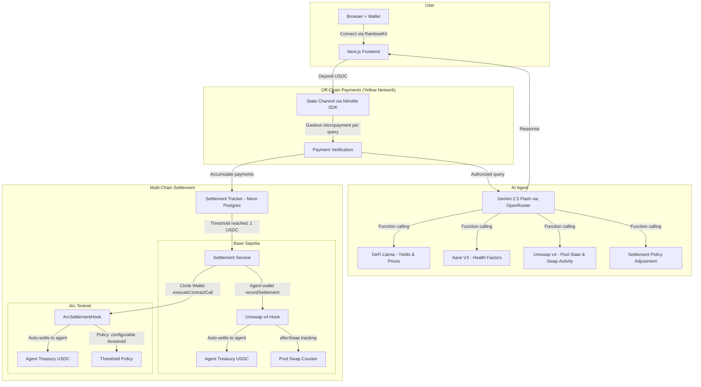

# QueryFi: Pay-per-Query DeFi Analytics

AI agent for on-demand DeFi analytics (yield opportunities, position health, impermanent loss, portfolio analysis) priced per query ($0.01 to $0.10) via gasless state channel micropayments.

No subscriptions. No overpaying. Connect, deposit, ask.

## Problem

DeFi analytics tools are either free (low quality, data harvesting) or $20 to $100/month subscriptions. If you just want to check your health factor once a week, you're stuck overpaying or using unreliable free tools.

## Solution

QueryFi charges per query. Payments happen off-chain through Yellow Network state channels. No gas, no confirmation wait.

| Query Type | Price |
|-----------|-------|
| Basic DeFi question | $0.01 |
| Health factor check | $0.02 |
| Impermanent loss calculation | $0.03 |
| Yield search | $0.05 |
| Portfolio analysis | $0.10 |

Deposit USDC into a state channel once. Each query deducts a micropayment instantly. When payments accumulate to $1, they auto-settle on-chain via a Uniswap v4 hook into the agent's Circle-managed treasury.

## Architecture



### How it works

1. User connects wallet, deposits USDC into a Yellow Network state channel
2. Each query deducts an off-chain micropayment (no gas)
3. AI agent (Gemini 2.5 Flash) processes the query with 8 tools: DeFi Llama (yields/prices), Aave V3 (health factors), Uniswap v4 pool state, hook swap activity, settlement policy adjustment, IL calculator, agent wallet
4. Micropayments accumulate in Neon Postgres until the $1 threshold
5. Settlement fires on both chains in parallel:
   - **Base Sepolia**: Circle Wallet calls `recordSettlement()` on the v4 hook, creating an on-chain audit trail and transferring USDC
   - **Arc testnet**: Circle Wallet calls `depositMicropayment()` on `ArcSettlementHook`
6. Hooks auto-settle accumulated USDC to the agent treasury

### Security & Intelligence

- **Server-side payment verification**: API validates payment proof (appSessionId + monotonic version) before processing any query. Returns 402 Payment Required on missing or replayed payments. No free rides.
- **Conversation context**: AI agent receives the last 10 messages of conversation history, so follow-up queries like "what about on Arbitrum?" work after a yield search.
- **Volume-aware recommendations**: The `get_swap_activity` tool analyzes on-chain swap count vs. current threshold and proactively recommends policy adjustments (e.g., 20+ swaps with threshold above $0.25 triggers a suggestion to lower it).
- **Settlement counter tracking**: `_settle()` correctly increments `settlementCount` and `totalSettled` on every auto-settlement, providing a complete on-chain audit trail.

## Sponsor Integrations

### Yellow Network

`@erc7824/nitrolite` v0.5.3, connected to `wss://clearnet-sandbox.yellow.com/ws`

466-line WebSocket client (`lib/yellow-client.ts`) handling the full lifecycle: EIP-712 auth, session creation, micropayment state updates, keepalive pings, reconnection with exponential backoff, balance tracking. This is the core payment rail. Every query goes through it.

### Uniswap Foundation: v4 Agentic Finance

`MicropaymentSettlementHook.sol`, a `BaseHook` + `ReentrancyGuard` on Base Sepolia with `afterSwap` permission only. 55 Foundry tests including fuzz tests.

The AI agent programmatically interacts with the v4 pool and hook without human intervention:

1. **Reads on-chain state**: queries `PoolManager.extsload()` for live sqrtPriceX96, tick, and liquidity
2. **Monitors hook activity**: reads `totalSwapsTracked`, `accumulatedBalance`, `settlementCount`, `totalSettled` directly from the hook contract
3. **Makes autonomous decisions**: analyzes swap volume and generates threshold recommendations (e.g., high activity means lower threshold for faster payouts)
4. **Executes on-chain transactions**: calls `setSettlementThreshold()` to adjust settlement policy based on its analysis, without user prompting
5. **Reports pool state**: translates raw v4 state (sqrtPriceX96, ticks) into human-readable analytics for users

The hook itself accumulates micropayments via `depositMicropayment()` and auto-settles to the agent wallet at the configurable threshold. `afterSwap` tracks swap counts per pool. Deployed via HookMiner CREATE2 for correct flag bits.

### Circle/Arc: Track B, Global Payouts & Treasury

`@circle-fin/developer-controlled-wallets` v10.1.0, SCA wallet on Base Sepolia.

The agent's treasury is a Circle Programmable Wallet. It receives USDC settlements from the hook and can withdraw to an external address. The contract interaction API (`executeContractCall()`) provides a secure allowlist for hook calls. Settlement runs on both Base Sepolia and Arc testnet via Circle Wallets in parallel -- each chain has its own Circle SCA wallet calling its respective hook contract.

The `ArcSettlementHook` on Arc adds configurable thresholds via `setSettlementThreshold()`, so the agent can adjust payout policy dynamically. 48 Foundry tests.

## Deployed Contracts

### Base Sepolia

| Item | Address / TxID |
|------|---------------|
| **MicropaymentSettlementHook** | [`0x974E39C679dd172eC68568cBa6f62CdF4BFeC040`](https://sepolia.basescan.org/address/0x974E39C679dd172eC68568cBa6f62CdF4BFeC040) |
| **Hook deployment tx** | [`0x5861fc42...`](https://sepolia.basescan.org/tx/0x5861fc42b64e981a4ddebe40e55a01c7cd5e528325331558a29e959f9f3572a3) |
| **Pool initialization tx** | [`0x6ff8b2f6...`](https://sepolia.basescan.org/tx/0x6ff8b2f6a5f3d97dafdcb899a992e527265e85bf1d5169163a75ebef4465391e) |
| **PoolManager (v4)** | [`0x05E73354cFDd6745C338b50BcFDfA3Aa6fA03408`](https://sepolia.basescan.org/address/0x05E73354cFDd6745C338b50BcFDfA3Aa6fA03408) |
| **USDC** | [`0x036CbD53842c5426634e7929541eC2318f3dCF7e`](https://sepolia.basescan.org/address/0x036CbD53842c5426634e7929541eC2318f3dCF7e) |
| **Agent wallet (Circle SCA)** | [`0x7dF4f69D82fb5594481eC99ec34479034fF26D9D`](https://sepolia.basescan.org/address/0x7dF4f69D82fb5594481eC99ec34479034fF26D9D) |
| **Pool** | USDC/WETH, 3000 bps fee, tick spacing 60, hook attached |

### Arc Testnet (Chain ID: 5042002)

| Item | Address / TxID |
|------|---------------|
| **ArcSettlementHook** | [`0xE8FE7028671C26f9A0843d5c24B0019bfa8d5A00`](https://testnet.arcscan.app/address/0xE8FE7028671C26f9A0843d5c24B0019bfa8d5A00) |
| **Deployment tx** | [`0x46f096cb...`](https://testnet.arcscan.app/tx/0x46f096cbb5188dacead06ff2f06b80d644652a09a938b4c49c64b4f350f2a52e) |
| **USDC (native)** | [`0x3600000000000000000000000000000000000000`](https://testnet.arcscan.app/address/0x3600000000000000000000000000000000000000) |

## Tech Stack

| Layer | Technology |
|-------|-----------|
| Frontend | Next.js 16, React 19, RainbowKit, shadcn/ui, Tailwind |
| Micropayments | Yellow Network Nitrolite SDK (`@erc7824/nitrolite`) |
| AI | Gemini 2.5 Flash via OpenRouter (function calling) |
| Data | DeFi Llama (yields + prices), Aave V3 (direct RPC), Uniswap v4 (extsload) |
| Settlement | Uniswap v4 BaseHook + ArcSettlementHook, Solidity 0.8.26 |
| Database | Neon Postgres + Drizzle ORM (serverless-safe persistence) |
| Agent Wallet | Circle Programmable Wallets (SCA) |
| Tests | Foundry, 103 tests (55 Base + 48 Arc), including fuzz |

## Quick Start

```bash
git clone https://github.com/kshitij-hash/QueryFi.git
cd queryfi
pnpm install
cp packages/app/.env.example packages/app/.env.local
# fill in API keys + DATABASE_URL (Neon connection string)
pnpm --filter @queryfi/app drizzle-kit push   # create tables
pnpm dev
```

For smart contracts:

```bash
cd packages/contracts
forge install
forge build
forge test -vvv
```

See `packages/app/.env.example` for all required variables. You'll need keys from [WalletConnect](https://cloud.walletconnect.com), [OpenRouter](https://openrouter.ai/keys), [Circle Console](https://console.circle.com), and a [Neon](https://console.neon.tech) database.

## Project Structure

```
queryfi/
├── packages/
│   ├── app/                        # Next.js frontend + API routes
│   │   ├── app/api/
│   │   │   ├── query/              # Main query endpoint
│   │   │   └── agent/              # Wallet, settle, contract endpoints
│   │   ├── components/
│   │   │   ├── defi-chat.tsx       # Chat UI with Yellow payments
│   │   │   └── agent-treasury.tsx  # Treasury dashboard
│   │   ├── drizzle.config.ts       # Drizzle Kit config
│   │   └── lib/
│   │       ├── db/                  # Neon Postgres + Drizzle schema
│   │       ├── yellow-client.ts    # Yellow Network client (466 lines)
│   │       ├── defi-agent.ts       # AI agent with 8 tools
│   │       ├── circle-wallet.ts    # Circle SDK integration
│   │       ├── settlement-service.ts
│   │       └── settlement-tracker.ts
│   └── contracts/                  # Foundry
│       ├── src/                    # MicropaymentSettlementHook + ArcSettlementHook
│       ├── test/                   # 103 tests
│       └── script/                 # Deploy, init pool, E2E
├── package.json
├── pnpm-workspace.yaml
└── README.md
```

## Product Feedback

### Yellow Network

We built a 466-line WebSocket client on top of the Nitrolite SDK. The auth flow (`createAuthRequestMessage` then challenge then `createAuthVerifyMessageFromChallenge`) works well with EIP-712 signing. State channel payments are genuinely fast, sub-50ms per micropayment, which makes per-query pricing actually feel instant.

Pain points we hit:
- ClearNode sandbox drops connections without a close frame sometimes. We added reconnection with exponential backoff, but a server-side heartbeat would help us distinguish crashes from intentional disconnects
- Had to reverse-engineer the `createStateUpdateMessage` format for balance reallocation. More examples in docs would save time
- Session expiry behavior is undocumented. We went with 24-hour sessions but it's unclear what happens to in-flight updates when one expires
- No TypeScript types for ClearNode WebSocket response payloads, so we had to use `any` for raw responses
- Would really benefit from a local mock ClearNode for testing without hitting the live sandbox

### Circle

`executeContractCall()` is great for this use case. The agent interacts with the hook contract without us managing a raw private key. SCA wallets feel right for autonomous agents.

Things that slowed us down:
- Entity secret is generate-once-or-lose-it. We almost bricked our setup before realizing there's no recovery
- Testnet faucet caps at 20 USDC / 2 hours, painful during rapid iteration
- No batch transaction support. We need approve + deposit as two separate calls, which adds latency to settlement
- Transaction status is polling-only. WebSocket updates would be much cleaner

## AI Tool Usage

| Tool | How we used it |
|------|---------------|
| **Claude Code** | Implementation help, Foundry tests, deployment scripts, docs. Architecture and integration decisions were ours. |
| **Gemini 2.5 Flash** | Production feature, powers the DeFi analytics agent via OpenRouter. Not a dev tool. |

## Hackathon Tracks

**Yellow Network, Integrate Yellow SDK** ($15K): Pay-per-use DeFi analytics powered by state channel micropayments. Each query deducts a gasless off-chain payment via Nitrolite, demonstrating Yellow as a payment rail for usage-based pricing.

**Uniswap Foundation, Agentic Finance** ($5K): AI agent autonomously reads v4 pool state via `extsload()`, monitors hook swap activity on-chain, generates volume-based threshold recommendations, and executes `setSettlementThreshold()` transactions without human intervention. The v4 hook accumulates micropayments and auto-settles to the agent's treasury.

**Arc/Circle, Global Payouts & Treasury, Track B** ($2.5K):

> Submitting for Track B: Build Global Payouts and Treasury Systems with USDC on Arc

- Automated payouts: settlement fires autonomously at the $1 threshold
- Multi-chain: Base Sepolia (Circle wallet) + Arc testnet (Circle wallet) in parallel
- Policy-based: `ArcSettlementHook` has configurable thresholds via `setSettlementThreshold()`
- Treasury: Circle SCA wallet receives USDC, supports programmatic withdrawals
- Required tools: Arc, USDC, Circle Wallets

---

Built at [HackMoney 2026](https://ethglobal.com/events/hackmoney2026)
